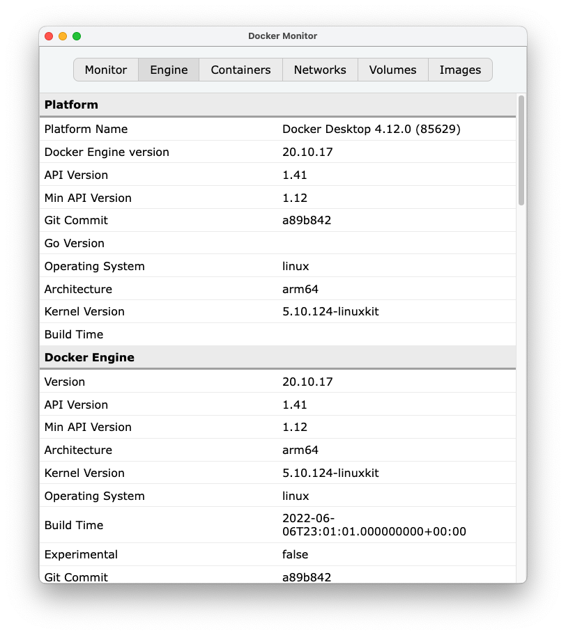

# Docker Monitor

## About

Browser client to the [Docker Engine API](https://docs.docker.com/engine/api) (v1.41).

## Screenshot



## Setup

### What I'm using

- Mac mini, M1 2020
- MacOS 12.6
- Docker Desktop 4.12
- Node 18.9
- npm 8.19

### Docker HTTP Server

This monitor is a TCP client.

See `src/config.js`.

_By default the Docker daemon (`dockerd`) binds to a Unix-domain socket for serving the HTTP-based API. But Docker can also be configured to have the daemon bind to a TCP port instead. Look for the socket option on the `dockerd` [reference page](https://docs.docker.com/engine/reference/commandline/dockerd/#daemon-socket-option)._

I had trouble with the former approach, and didn't want to bother to figure it out. A quick hack is to write a proxy script that reads from the Unix-domain socket, binds to a TCP port, and passes messages in both directions. You will have to do this on your own. 🍉

### Starting the monitor

```
npm install
npm run start
```

## Notes

### Complete list of endpoints

Reference: [Docker Engine API (1.41)](https://docs.docker.com/engine/api/v1.41)

```
[x] used by the monitor
[ ] not used yet, or outside scope of project


Containers

[x]  GET    /v1.41/containers/json
[ ]  POST   /v1.41/containers/create
[ ]  GET    /v1.41/containers/{id}/json
[ ]  GET    /v1.41/containers/{id}/top
[ ]  GET    /v1.41/containers/{id}/logs
[ ]  GET    /v1.41/containers/{id}/changes
[ ]  GET    /v1.41/containers/{id}/export
[ ]  GET    /v1.41/containers/{id}/stats
[ ]  POST   /v1.41/containers/{id}/resize
[ ]  POST   /v1.41/containers/{id}/start
[ ]  POST   /v1.41/containers/{id}/stop
[ ]  POST   /v1.41/containers/{id}/restart
[ ]  POST   /v1.41/containers/{id}/kill
[ ]  POST   /v1.41/containers/{id}/update
[ ]  POST   /v1.41/containers/{id}/rename
[ ]  POST   /v1.41/containers/{id}/pause
[ ]  POST   /v1.41/containers/{id}/unpause
[ ]  POST   /v1.41/containers/{id}/attach
[ ]  GET    /v1.41/containers/{id}/attach/ws
[ ]  POST   /v1.41/containers/{id}/wait
[ ]  DELETE /v1.41/containers/{id}/
[ ]  HEAD   /v1.41/containers/{id}/archive
[ ]  GET    /v1.41/containers/{id}/archive
[ ]  PUT    /v1.41/containers/{id}/archive
[ ]  POST   /v1.41/containers/{id}/prune

Images

[x]  GET    /v1.41/images/json
[ ]  POST   /v1.41/build
[ ]  POST   /v1.41/build/prune
[ ]  POST   /v1.41/images/create
[x]  GET    /v1.41/images/{name}/json
[ ]  GET    /v1.41/images/{name}/history
[ ]  POST   /v1.41/images/{name}/push
[ ]  POST   /v1.41/images/{name}/tag
[ ]  DELETE /v1.41/images/{name}
[ ]  GET    /v1.41/images/search
[ ]  POST   /v1.41/images/prune
[ ]  POST   /v1.41/commit
[ ]  GET    /v1.41/images/{name}/get
[ ]  GET    /v1.41/images/get
[ ]  POST   /v1.41/images/load

Networks

[x]  GET    /v1.41/networks
[x]  GET    /v1.41/networks/{id}
[ ]  DELETE /v1.41/networks/{id}
[ ]  POST   /v1.41/networks/create
[ ]  POST   /v1.41/networks/{id}/connect
[ ]  POST   /v1.41/networks/{id}/disconnect
[ ]  POST   /v1.41/networks/prune

Volumes

[x]  GET    /v1.41/volumes
[ ]  POST   /v1.41/volumes/create
[x]  GET    /v1.41/volumes/{name}
[ ]  DELETE /v1.41/volumes/{name}
[ ]  POST   /v1.41/volumes/prune

Exec

[ ]  POST   /v1.41/containers/{id}/exec
[ ]  POST   /v1.41/exec/{id}/start
[ ]  POST   /v1.41/exec/{id}/resize
[ ]  GET    /v1.41/exec/{id}/json

Swarm

[ ]  GET    /v1.41/swarm
[ ]  POST   /v1.41/swarm/init
[ ]  POST   /v1.41/swarm/join
[ ]  POST   /v1.41/swarm/leave
[ ]  POST   /v1.41/swarm/update
[ ]  GET    /v1.41/swarm/unlockkey
[ ]  POST   /v1.41/swarm/unlock

Nodes

[ ]  GET    /v1.41/nodes
[ ]  GET    /v1.41/nodes/{id}
[ ]  DELETE /v1.41/nodes/{id}
[ ]  POST   /v1.41/nodes/{id}/update

Services

[ ]  GET    /v1.41/services
[ ]  POST   /v1.41/services/create
[ ]  GET    /v1.41/services/{id}
[ ]  DELETE /v1.41/services/{id}
[ ]  POST   /v1.41/services/{id}/update
[ ]  GET    /v1.41/services/{id}/logs

Tasks

[ ]  GET    /v1.41/tasks
[ ]  GET    /v1.41/tasks/{id}
[ ]  GET    /v1.41/tasks/{id}/logs

Secrets

[ ]  GET    /v1.41/secrets
[ ]  POST   /v1.41/secrets/create
[ ]  GET    /v1.41/secrets/{id}
[ ]  DELETE /v1.41/secrets/{id}
[ ]  POST   /v1.41/secrets/{id}/update

Configs

[ ]  GET    /v1.41/configs
[ ]  POST   /v1.41/configs/create
[ ]  GET    /v1.41/configs/{id}
[ ]  DELETE /v1.41/configs/{id}
[ ]  POST   /v1.41/configs/{id}/update

Plugins

[ ]  GET    /v1.41/plugins
[ ]  GET    /v1.41/plugins/privileges
[ ]  POST   /v1.41/plugins/pull
[ ]  GET    /v1.41/plugins/{name}/json
[ ]  DELETE /v1.41/plugins/{name}
[ ]  POST   /v1.41/plugins/{name}/enable
[ ]  POST   /v1.41/plugins/{name}/disable
[ ]  POST   /v1.41/plugins/{name}/upgrade
[ ]  POST   /v1.41/plugins/create
[ ]  POST   /v1.41/plugins/{name}/push
[ ]  POST   /v1.41/plugins/{name}/set

System

[ ]  POST   /v1.41/auth
[x]  GET    /v1.41/info
[x]  GET    /v1.41/version
[x]  GET    /v1.41/_ping
[ ]  HEAD   /v1.41/_ping
[x]  GET    /v1.41/events
[ ]  GET    /v1.41/system/df

Distribution

[ ]  GET    /v1.41/distribution/{name}/json

Session

[ ]  POST   /v1.41/session
```
